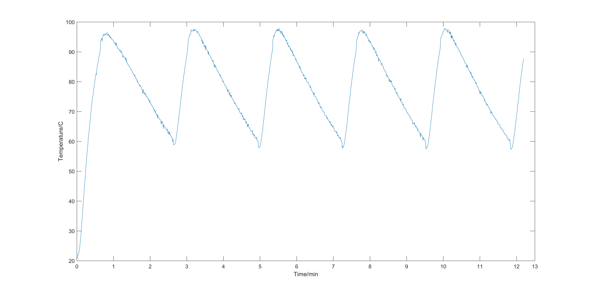
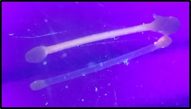

# A PCR based antibiotic resistance gene detector

## Synopsis
Modern day biomedicine has been revolutionised by the introduction of molecular diagnostic methods. With recent advancement of high throughput DNA and protein sequencing technologies we are living in the omics era where personalised medicine became a familiar term. Despite significant technological advancement, molecular diagnostic methods are not within the reach of most people in the developing world. For example, antibiotic resistant (Multiple drug resistance or MDR and Extensively drug-resistant or XDR) forms of Mycobacterium tuberculosis, is a rising threat to the world and it is necessary to detect the presence of such resistant strains in patient samples as early as possible. Polymerase chain reaction (PCR) based methods for the detection of antibiotic resistant form of bacteria exist in the market, but use of such technology is not cost effective and often depend on expensive hardware along with continuous purchase of consumables like specific cartridges. Here, in this project we propose to develop a microfluidics based, reusable module, mainly to detect the presence of antibiotic resistant bacterial genes in patient samples. 

     

## Software
### [Thermocycling](Code/PCR_code)
The code to controll the thermocycling/PCR. Holds a max of 90 degrees for 10s and a min of 60 for 10s for a total of 35 cycles.
Variables of max and min time, time for which these temps should be maintained, nuber of cycles can be varied.
### Flurecence sensing
The detector is yet to be calibrated, for now a simple [code](Code/Detector) to colect analogue input is used on samples of known concentration to determine threshold levels.

## Hardware

### Sample contaiment
Curently the sample is healed in PVC tubing sealed at either end with silica. A presurised system to move the sample from the PCR to the flurecence detetion stage is in devlopment.
### Thermocycling
Thermocyclin is facilitated through alternating swiching between a heating element, and a peltier cooler and fan. The swiching is achived using a pair of realays controled by the arduino. The temperature of the heaing plate is taken as the reference temperature.
### Flurecence sensing
Flurecece exitation is achived ising n LED. A photodiode is sedas aa detector and a high pass filter blocks out the exitation wavelengths. 
### Interface
An RGB LCD is used to display current temperature Cycle number and proces (heaing or cooling).

## Installation, Maintenance and Testing Guide
Curently the thermocycling performace achived can be seen bellow:

The Leveles of lurecence obtained after PCR compared to a control can be seen below:

